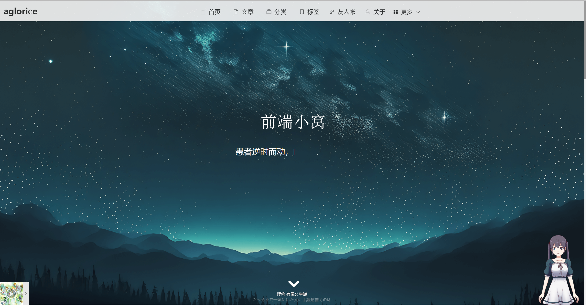
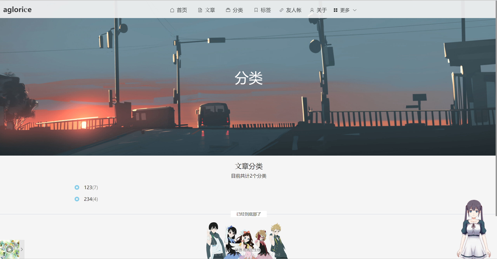
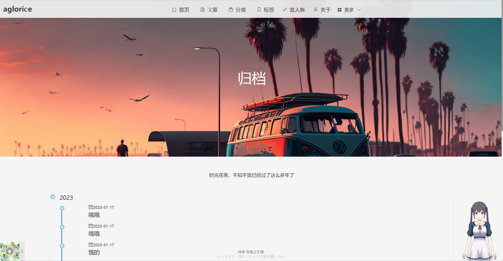

# myblog-django-vue


## 前言
这是一个使用vue2开发的博客，使用响应式布局，后端使用```django```开发，作为学习vue以来的第一个项目,
也许在很多地方会有很多不合理的地方，但是我也会慢慢的不断改进，该项目会不断被的更新下去的，希望它能够变得
越来越完善。
## 技术栈
vue2+vue-router+vuex+axios+echarts+bootstrap-vue+sass
## 部分页面展示
### 首页


### 分类


### 追番列表


### 归档页面


## 项目运行
```
git clone https://github.com/aglorice/myblog-django-vue.git

cd myblog-django-vue

npm install(安装依赖)

npm run serve
```


